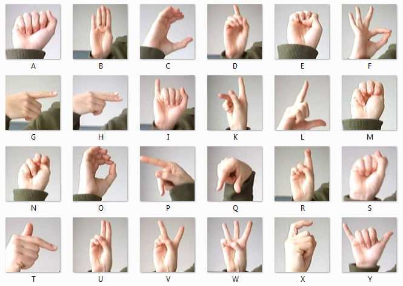

# SignBridge - Sign Language Recognition Dashboard + Containerized App

[](https://github.com/swe-students-spring2026/4-containers-next_team/actions/workflows/ci.yml)
[](https://github.com/swe-students-spring2026/4-containers-next_team/actions/workflows/lint.yml)


## App Description:
SignBridge is an educational web platform that helps users understand sign language recognition results through an interactive dashboard.

***Product Vision***: The app aims to make sign language recognition more useful in educational settings, making sign language technology more understandable, accessible, and meaningful for real users.

This makes the project especially useful for two types of users:
- people who want a clearer way to visualize and review sign language recognition results
- learners who want to better understand how sign language gestures are recognized over time

## Product User Stories
### User Type 1: People who rely on sign language support
1. As a user who communicates with sign language, I want the system to recognize my hand gestures so that my signed input can be interpreted on screen.
2. As a user who communicates with sign language, I want to see live prediction results so that I can know whether the system is recognizing my gesture correctly in real time.
3. As a user who communicates with sign language, I want to view confidence scores so that I can judge how reliable the current prediction is.
4. As a user who communicates with sign language, I want the app to store past predictions so that I can review what was recognized earlier.
5. As a user who communicates with sign language, I want a history page so that I can track previous gesture results instead of losing them after the live view changes.
6. As a user who communicates with sign language, I want timestamped prediction records so that I can understand when each gesture was captured.
7. As a user who communicates with sign language, I want the interface to display recognition output clearly so that the results are easy to read and interpret.
8. As a user who communicates with sign language, I want the system to separate live results from historical results so that I can focus on either the current gesture or past records.
9. As a user who communicates with sign language, I want the application to save results in a database so that my recent recognition history is not lost when the page updates.
10. As a user who communicates with sign language, I want a simple web interface for checking recognition results so that I do not need to interact directly with the model code.

### User Type 2: People who want to learn sign language
1. As a learner, I want to see the predicted label for a gesture so that I can compare my hand sign with the system’s interpretation.
2. As a learner, I want to view live recognition results while practicing so that I can get immediate feedback.
3. As a learner, I want to see confidence scores so that I can tell when my gesture is being recognized more accurately.
4. As a learner, I want to review historical predictions so that I can look back at my practice results.
5. As a learner, I want stored prediction records with timestamps so that I can observe my progress across different practice sessions.
6. As a learner, I want a dashboard instead of raw terminal output so that the recognition results are easier to understand.
7. As a learner, I want the system to organize prediction data in one place so that I can review both recent and past activity more efficiently.
8. As a learner, I want the project to show how sign language recognition works end-to-end so that I can better understand the relationship between image input, prediction, and displayed output.
9. As a learner, I want a history view of recognized gestures so that I can identify repeated mistakes in my practice.
10. As a learner, I want an accessible educational tool rather than just a model demo so that I can engage with sign language recognition in a more practical way.

## Product Overview
SignBridge is containerized computer vision application designed to recognize and translate sign language gestures in real-time. The project uses a Machine Learning client (utilizing OpenCV and a Convolutional Neural Network trained on the Sign Language MNIST dataset) to detect American Sign Language (ASL) alphabet gestures from a video feed, and saves the classification results to a MongoDB database. A Flask web dashboard reads this database to show the translated gestures and confidence scores in real-time.

## Team Members
- [Hollan Yuan](https://github.com/hwyuanzi)
- [Jonas Chen](https://github.com/JonasChenJusFox)
- [Ruby Zhang](https://github.com/yz10113-tech)
- [Suri Su](https://github.com/suri-zip)
- [Zeyue Xu](https://github.com/zeyuexu123)

## System Architecture
This project is containerized using Docker and is split into three main parts, run together using Docker Compose:

The application consists of three main services:
```text
+---------------------------+      +-----------------------+      +---------------------------+
| Machine Learning Client   | ---> | MongoDB Database      | ---> | Flask Web Dashboard       |
| OpenCV + CNN Inference    |      | Stores Predictions    |      | Visualizes Results        |
+---------------------------+      +-----------------------+      +---------------------------+
```

1. **Machine Learning Client**: The machine learning client is a Python-based service that captures video frames with OpenCV, processes the hand region, and classifies gestures using a custom CNN model trained on the Sign Language MNIST dataset.
2. **Web App**: The web app is built with Flask and provides an interactive dashboard for viewing live prediction results, confidence scores, and historical gesture data.
3. **Database**: The database uses MongoDB to store timestamped prediction results, confidence scores, and related metadata, allowing the system to retrieve and display both recent and past predictions.

## Project Structure

```bash
4-containers-next_team/
├── .automations/
├── .claude/
├── .cursor/
├── .githooks/
├── .github/
├── machine-learning-client/
│   ├── src/
│   │   ├── camera.py
│   │   ├── data.py
│   │   ├── inference.py
│   │   ├── model.py
│   │   ├── prediction_log.py
│   │   ├── preprocessing.py
│   │   ├── server.py
│   │   ├── src_config.py
│   │   ├── src_main.py
│   │   ├── test_data_loader.py
│   │   ├── train.py
│   │   └── val.py
│   ├── tests/
│   │   └── test_main.py
│   ├── Dockerfile
│   ├── Pipfile
│   ├── Pipfile.lock
│   ├── config.py
│   ├── main.py
│   └── readme.txt
├── web-app/
│   ├── db/
│   │   ├── __init__.py
│   │   ├── game_progress.py
│   │   ├── import_data.py
│   │   └── mongo.py
│   ├── routes/
│   │   ├── __init__.py
│   │   ├── api.py
│   │   ├── game_api.py
│   │   └── pages.py
│   ├── services/
│   │   ├── __init__.py
│   │   ├── game_service.py
│   │   ├── prediction_service.py
│   │   └── speech_service.py
│   ├── static/
│   │   ├── css/
│   │   │   ├── game.css
│   │   │   └── style.css
│   │   ├── images/
│   │   │   ├── apple.jpg
│   │   │   ├── book.jpg
│   │   │   ├── cat.jpg
│   │   │   ├── data_science.jpg
│   │   │   ├── dog.jpg
│   │   │   ├── i_love_you.jpg
│   │   │   ├── music.jpg
│   │   │   ├── phone.jpg
│   │   │   ├── smart_home.jpg
│   │   │   └── thank_you.jpg
│   │   └── js/
│   │       ├── dashboard.js
│   │       ├── game.js
│   │       └── speaker.js
│   ├── templates/
│   │   ├── base.html
│   │   ├── history.html
│   │   └── index.html
│   ├── tests/
│   │   ├── test_api.py
│   │   ├── test_app.py
│   │   └── test_pages.py
│   ├── Dockerfile
│   ├── Pipfile
│   ├── Pipfile.lock
│   ├── app.py
│   ├── config.py
│   └── readme.txt
├── .gitignore
├── LICENSE
├── Pipfile
├── Pipfile.lock
├── README.md
├── docker-compose.yml
└── instructions.md
```

## Running the Application

Follow these steps to run the project, this project can be run in two ways depending on your development needs:
 - **1. Web App (Flask) — Running Locally**
 - **2. Docker**

For local development, install:
- Git
- Python 3
- Pipenv

For Docker workflow, install:
- Git
- Docker Desktop
- Docker Compose

**Clone the repository**
```bash
git clone https://github.com/swe-students-spring2026/4-containers-next_team.git
cd 4-containers-next_team
```

### Environment Variables ###
This project requires a `.env` file for config. Both the local development workflow and the Docker workflow read from this file automatically. 

If the `.env` file is missing, create it by copying the provided template:
```bash
cp .env.example .env
```
Please configure the username and password in the file.
Docker compose will use this file. The default values inside are fine for running the app locally, but the file just needs to be there.


## Workflow 1: Web App — Running Locally ## 

**1. Start the Machine Learning Client** 

Run in sequence one after another
```bash
cd machine-learning-client
pipenv install     # Install pipenv
mkdir -p data/processed      # Store the training data
PYTHONPATH=src pipenv run python src/train.py    # Train the model to generate the.pth file
PYTHONPATH=src pipenv run python src/val.py
PYTHONPATH=src pipenv run python main.py    # Run the back-end
```

**2 Start the Web App**

Split a new terminal window
```bash
cd web-app
pipenv install  # Install pipenv
pipenv run python app.py # Run the front-end
```
Go to [web](http://localhost:5001) in your browser to see the App.

### Testing ###

**Test Machine Learning Client**
```bash
cd machine-learning-client
PYTHONPATH=src pipenv run pytest
```

**Test Web App**
```bash
cd web-app
PYTHONPATH=. pipenv run pytest
```

**Optional Camera / Grayscale Preview**
```bash
cd machine-learning-client
PYTHONPATH=src pipenv run python src/camera.py
```


## Workflow 2: Run with Docker

**1. Provide a sample video**
To avoid hardware permission issues with webcams inside Docker containers, our ML client processes a sample video feed for testing. You need to provide a short video of hand gestures or create a placeholder file in `machine-learning-client/data/raw/` *before* running docker-compose.
```bash
# Ensure the model directory exists
mkdir -p machine-learning-client/src/data/processed/
mkdir -p machine-learning-client/src/data/raw/

# Place your trained weights file here (e.g., model.pth for PyTorch or model.h5 for Keras)
# Path should look like: machine-learning-client/data/model/sign_language_model.pth
```


**2. Train the model**
```bash
cd machine-learning-client
PYTHONPATH=src pipenv run python src/train.py
PYTHONPATH=src pipenv run python src/val.py
```

**3. Start the containers**
Build and start everything:
```bash
docker-compose up --build
```
*(You can add `-d` at the end to run them in the background).*

**4. View the app and logs**
- **Web App:** Go to [web](http://localhost:5001) in your browser to see the App.

- **ML Client Logs:** To check if the machine learning client is running and processing the video, open a new terminal and run:
  ```bash
  docker logs ergonomics_ml
  ```
- **Database:** MongoDB runs on port 27017 automatically.

**5. Shutting down**
When you're done, stop the containers properly so your database data isn't lost:
```bash
docker-compose down
```

## Dataset Source
This project is based on the Sign Language MNIST dataset:
[Dataset](https://www.kaggle.com/datasets/datamunge/sign-language-mnist?resource=download)



The dataset is cited here as the source of the training data. Downloading it is not required to run the application.

## Development Workflow

We use a basic Agile workflow for this project:

- **Task Board**: We track tasks using the GitHub Projects board linked to this repo.
- **Dependencies**: Each subsystem (`web-app` and `machine-learning-client`) manages its own dependencies using Pipenv to keep things separated.
- **CI / CD Pipeline**: We use Github Actions for CI. Any pull request has to pass Pytest (with >80% coverage) and linting checks (Pylint & Black) before we can merge it into the main branch.
